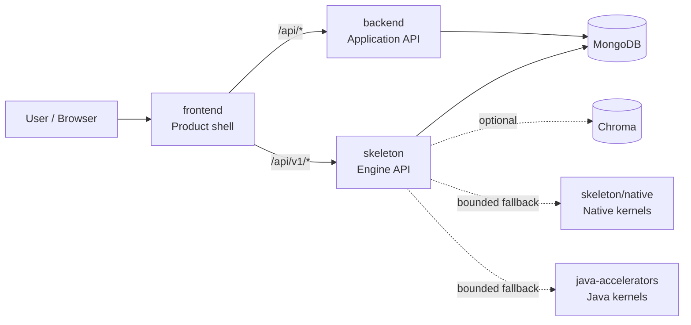

# Architecture Map

**Architecture tag:** `arch-map/v3.1`
**Machine contract:** `machine/architecture.json`
**Runtime contract:** `skeleton/app/manifest.json`
**Validator:** `python scripts/check_architecture_map.py`

This map is the canonical bridge between repository structure and the assembled
application. It deliberately optimizes structure before mass file movement:
ownership, interfaces, dependency direction, CI routing, and migration rules are
made explicit first. Physical moves are then safe, bounded, and independently
reviewable.

## 1. Optimized logical structure

```text
Skeleton/
├── frontend/                 # Product shell, browser/native UI, web ingress
├── backend/                  # Application API and product-control plane
├── skeleton/                 # Engine runtime and engine API
│   ├── app/                  # Whole-application operator/runtime contract
│   ├── api/                  # Engine HTTP surface
│   ├── agents/               # Agent orchestration
│   ├── kernel/               # Core primitives
│   ├── memory/               # Memory/retrieval planes
│   ├── retrieval/            # Retrieval and ranking
│   ├── resilience/           # Fault/security boundaries
│   ├── observability/        # Telemetry
│   └── native/               # Optional native acceleration
├── java-accelerators/        # Optional Java 21 acceleration
├── machine/                  # Machine-readable repository/architecture state
├── .machine/                 # Machine-local/control metadata
├── scripts/                  # Deterministic validation/operator tools
├── .github/                  # CI and repository automation
├── docs/                     # Human architecture and operating knowledge
└── tests/                    # Repository-level regression/evidence
```

The important optimization is not the number of directories. It is that every
live capability has one canonical owner and every cross-owner dependency has an
explicit contract.

## 2. Runtime topology



Canonical runtime services remain the five services declared by
`skeleton/app/manifest.json`: `frontend`, `backend`, `skeleton`,
`mongo`, and optional `chroma`.

The frontend is the only human-interface root. The backend owns application
policy and product control. Skeleton owns engine primitives, orchestration,
retrieval, resilience, and engine APIs. Accelerators are optional execution
backends and never own business policy.

## 3. Contract layering

There are four canonical contract layers, each with one job:

1. **`skeleton/app/manifest.json` — runtime contract.** Services, runtime modes,
   health paths, required environment, and Compose topology.
2. **`machine/manifest.json` — repository-machine contract.** Repository
   integration state, automation-oriented metadata, branch families, and
   machine-facing inventory.
3. **`machine/architecture.json` — architecture contract.** Canonical roots,
   ownership zones, dependency graph, interfaces, change routing, optimization
   lanes, and migration policy.
4. **`machine/ai_app_construction.json` — AI construction contract.** Required
   capability planes, build phases, provider bootstraps, acceptance gates, gap
   register, and closure evidence. Its human manual is
   `docs/AI_APP_CONSTRUCTION_MANUAL.md`.

`scripts/check_architecture_map.py`, `scripts/check_ai_app_construction.py`, and
`scripts/check_provider_bootstrap.py` link the layers. It rejects drift when the
architecture service graph no longer exactly matches the runtime manifest.

## 4. Dependency direction

Runtime dependency direction is intentionally small:

```text
mongo ───────► backend ───────► frontend
   └─────────► skeleton ──────► frontend

chroma  (optional data service)
skeleton ──► native / Java acceleration (optional, fallback-safe)
```

At source level, the dependency rules are:

- `frontend` may call `backend` and `skeleton` only through declared HTTP
  contracts.
- `backend` may use engine capabilities where explicitly integrated, but it
  does not own engine routes or primitives.
- `skeleton` must not import product-shell routing or frontend concerns.
- `skeleton/native` and `java-accelerators` accelerate engine work and must
  preserve deterministic fallback behavior.
- `machine`, `scripts`, and `.github` may inspect runtime roots but do not
  become runtime owners.

## 5. Public interfaces

| Interface | Contract |
| --- | --- |
| Frontend → Backend | canonical resolver in `frontend/utils/apiBase.ts`, then `/api/*` |
| Frontend → Engine | canonical resolver in `frontend/utils/apiBase.ts`, then `/api/v1/*` |
| Backend health | `GET /api/health` |
| Engine liveness | `GET /api/v1/health/live` |
| Engine → native | bounded native ABI with Python fallback |
| Engine → Java | bounded Java 21 execution path with Python fallback |

Feature code should not invent new endpoint resolution, environment lookup, or
cross-service health paths.

## 6. Fast change routing

Architecture-aware change routing shortens feedback by validating the affected
lane first while preserving the cross-service critical path.

| Lane | Primary paths | Focused validation |
| --- | --- | --- |
| UI | `frontend/**` | typecheck, web export, architecture |
| API | `backend/**` | backend quality, app assembly, architecture |
| Engine | `skeleton/**` | backend/runtime quality, app assembly, architecture |
| Accelerator | `skeleton/native/**`, `java-accelerators/**` | native/JVM contracts, architecture |
| Machine | `machine/**`, `.machine/**` | repository hygiene, architecture |
| Automation | `.github/**`, `scripts/**` | workflow security, hygiene, architecture |

The critical path is:

```text
static architecture
      ↓
app assembly
      ↓
focused domain tests
      ↓
merge readiness
```

Independent UI, engine/accelerator, API, and machine/automation work can run in
parallel before converging on merge readiness.

## 7. Structural rules

The architecture validator enforces these rules directly:

- canonical root IDs and paths are unique;
- canonical root paths exist;
- runtime nodes and zones resolve;
- runtime dependencies reference known nodes;
- the ownership-zone dependency graph is acyclic;
- the runtime dependency graph is acyclic;
- runtime node `path`, `kind`, `canonical`, and `depends_on` fields match
  `skeleton/app/manifest.json` exactly;
- interface endpoints resolve to known nodes or repository paths;
- runtime/control roots have an explicit change-routing lane;
- the architecture's linked contract files exist.

A new long-running service therefore cannot silently appear as another island:
it must be added to the runtime manifest and architecture map in the same
change.

## 8. Migration strategy

The repository is too active for a broad rename/move wave to be safe. Migration
uses a strangler-by-domain approach:

1. declare the canonical owner;
2. converge calls behind a stable interface;
3. add validation proving the interface;
4. migrate implementation files only when imports, routes, packaging, and CI
   ownership are explicit;
5. archive superseded snapshots instead of leaving competing live roots;
6. reconcile large branch families at file/domain level rather than merging
   history blindly.

This keeps current assembly work mergeable while steadily reducing duplicate
ownership. Current transitional top-level roots are `core`, `eval`, `memory`,
`satellites`, and `.emergent`; root `deploy.py` is a legacy operator entrypoint.
Their disposition is machine-readable in `machine/architecture.json`.

## 9. Architecture checkpoints

Architecture commits use an `arch-map/vX.Y` marker in commit messages. The
active machine contract also carries an `architecture_tag` so automation can
report which architecture version it validated.

Current checkpoint chain:

```text
arch-map/v1.0  canonical ownership + topology map
arch-map/v1.1  fail-closed architecture validator
arch-map/v1.2  regression tests for topology invariants
arch-map/v1.3  runtime/repository linkage + fail-fast CI + transitional-root policy
arch-map/v1.4  acyclic ownership zones + source-inventory alignment
arch-map/v2.0  complete AI application construction/manual contract
arch-map/v2.1  mandatory runtime provider architecture acknowledgement
arch-map/v2.2  construction/provider fail-closed validators
arch-map/v2.3  explicit SOTA gap register + closure evidence
arch-map/v2.4  fail-fast CI construction/provider gates
arch-map/v2.5  provider receipt enforcement at direct I/O + self-describing runtime status
arch-map/v2.6  current-state gap closure roadmap + universal construction gates
arch-map/v2.7  legacy backend AI service/provider convergence
arch-map/v2.8  truthful LLM/game routing through declared provider execution
arch-map/v2.9  shared provider receipt families + provider surface inventory
arch-map/v3.0  executable lifecycle/trust/data/work-package construction ledger
arch-map/v3.1  Wave 1 governance + resource admission enforced before provider I/O
```

## 10. Operator commands

```bash
# Validate architecture and complete AI construction contracts
python scripts/check_architecture_map.py
python scripts/check_ai_app_construction.py
python scripts/check_provider_bootstrap.py

# Machine-readable architecture result
python scripts/check_architecture_map.py --json

# Validate the complete assembled application
python -m skeleton app check

# Inspect runtime topology
python -m skeleton app status --json
```

Architecture changes should keep all four commands deterministic and
non-interactive.


## 11. Mandatory AI construction manual

All AI capability construction and provider integration is governed by
`machine/ai_app_construction.json` and
`docs/AI_APP_CONSTRUCTION_MANUAL.md`.

Runtime model providers are not trusted merely because credentials exist.
`skeleton/provider_contract.py` must load the active contracts and
issue a non-secret architecture receipt before `ProviderRegistry` can return an
active adapter. Undeclared providers fail closed.

Development-agent instruction files are pointers to the same contract, never
independent copies of the architecture. This prevents provider-specific
instructions from creating competing build rules.

Open P0 construction gaps are explicit and block claiming SOTA completion, but
they do not block incremental architecture work when the gap itself, its
construction plan, and its closure evidence are recorded.
