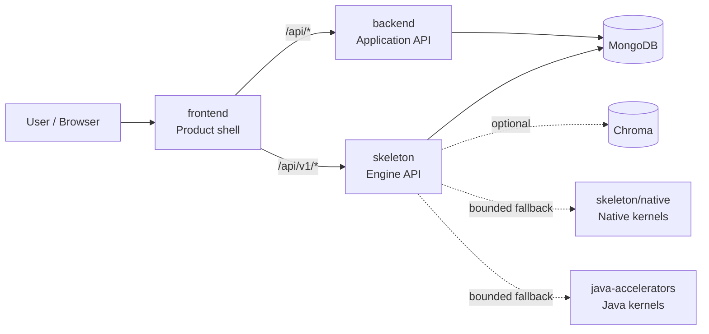

# Architecture Map

**Architecture tag:** `arch-map/v3.6`
**Machine contract:** `machine/architecture.json`
**Runtime contract:** `skeleton/app/manifest.json`
**Validator:** `python scripts/check_architecture_map.py`

This map is the canonical bridge between repository structure and the assembled
application. It deliberately optimizes structure before mass file movement:
ownership, interfaces, dependency direction, CI routing, and migration rules are
made explicit first. Physical moves are then safe, bounded, and independently
reviewable.

## 1. Optimized logical structure

```text
Skeleton/
├── frontend/                 # Product shell, browser/native UI, web ingress
├── backend/                  # Application API and product-control plane
├── skeleton/                 # Engine runtime and engine API
│   ├── app/                  # Whole-application operator/runtime contract
│   ├── api/                  # Engine HTTP surface
│   ├── agents/               # Agent orchestration
│   ├── kernel/               # Core primitives
│   ├── memory/               # Memory/retrieval planes
│   ├── retrieval/            # Retrieval and ranking
│   ├── resilience/           # Fault/security boundaries
│   ├── observability/        # Telemetry
│   └── native/               # Optional native acceleration
├── java-accelerators/        # Optional Java 21 acceleration
├── machine/                  # Machine-readable repository/architecture state
├── .machine/                 # Machine-local/control metadata
├── scripts/                  # Deterministic validation/operator tools
├── .github/                  # CI and repository automation
├── docs/                     # Human architecture and operating knowledge
└── tests/                    # Repository-level regression/evidence
```

The important optimization is not the number of directories. It is that every
live capability has one canonical owner and every cross-owner dependency has an
explicit contract.

## 2. Runtime topology



Canonical runtime services remain the five services declared by
`skeleton/app/manifest.json`: `frontend`, `backend`, `skeleton`,
`mongo`, and optional `chroma`.

The frontend is the only human-interface root. The backend owns application
policy and product control. Skeleton owns engine primitives, orchestration,
retrieval, resilience, and engine APIs. Accelerators are optional execution
backends and never own business policy.

## 3. Contract layering

There are four canonical contract layers, each with one job:

1. **`skeleton/app/manifest.json` — runtime contract.** Services, runtime modes,
   health paths, required environment, and Compose topology.
2. **`machine/manifest.json` — repository-machine contract.** Repository
   integration state, automation-oriented metadata, branch families, and
   machine-facing inventory.
3. **`machine/architecture.json` — architecture contract.** Canonical roots,
   ownership zones, dependency graph, interfaces, change routing, optimization
   lanes, and migration policy.
4. **`machine/ai_app_construction.json` — AI construction contract.** Required
   capability planes, build phases, provider bootstraps, acceptance gates, gap
   register, and closure evidence. Its human manual is
   `docs/AI_APP_CONSTRUCTION_MANUAL.md`.

`scripts/check_architecture_map.py`, `scripts/check_ai_app_construction.py`, and
`scripts/check_provider_bootstrap.py` link the layers. It rejects drift when the
architecture service graph no longer exactly matches the runtime manifest.

## 4. Dependency direction

Runtime dependency direction is intentionally small:

```text
mongo ───────► backend ───────► frontend
   └─────────► skeleton ──────► frontend

chroma  (optional data service)
skeleton ──► native / Java acceleration (optional, fallback-safe)
```

At source level, the dependency rules are:

- `frontend` may call `backend` and `skeleton` only through declared HTTP
  contracts.
- `backend` may use engine capabilities where explicitly integrated, but it
  does not own engine routes or primitives.
- `skeleton` must not import product-shell routing or frontend concerns.
- `skeleton/native` and `java-accelerators` accelerate engine work and must
  preserve deterministic fallback behavior.
- `machine`, `scripts`, and `.github` may inspect runtime roots but do not
  become runtime owners.

## 5. Public interfaces

| Interface | Contract |
| --- | --- |
| Frontend → Backend | canonical resolver in `frontend/utils/apiBase.ts`, then `/api/*` |
| Frontend → Engine | canonical resolver in `frontend/utils/apiBase.ts`, then `/api/v1/*` |
| Backend health | `GET /api/health` |
| Engine liveness | `GET /api/v1/health/live` |
| Engine → native | bounded native ABI with Python fallback |
| Engine → Java | bounded Java 21 execution path with Python fallback |

Feature code should not invent new endpoint resolution, environment lookup, or
cross-service health paths.

## 6. Fast change routing

Architecture-aware change routing shortens feedback by validating the affected
lane first while preserving the cross-service critical path.

| Lane | Primary paths | Focused validation |
| --- | --- | --- |
| UI | `frontend/**` | typecheck, web export, architecture |
| API | `backend/**` | backend quality, app assembly, architecture |
| Engine | `skeleton/**` | backend/runtime quality, app assembly, architecture |
| Accelerator | `skeleton/native/**`, `java-accelerators/**` | native/JVM contracts, architecture |
| Machine | `machine/**`, `.machine/**` | repository hygiene, architecture |
| Automation | `.github/**`, `scripts/**` | workflow security, hygiene, architecture |

The critical path is:

```text
static architecture
      ↓
app assembly
      ↓
focused domain tests
      ↓
merge readiness
```

Independent UI, engine/accelerator, API, and machine/automation work can run in
parallel before converging on merge readiness.

## 7. Structural rules

The architecture validator enforces these rules directly:

- canonical root IDs and paths are unique;
- canonical root paths exist;
- runtime nodes and zones resolve;
- runtime dependencies reference known nodes;
- the ownership-zone dependency graph is acyclic;
- the runtime dependency graph is acyclic;
- runtime node `path`, `kind`, `canonical`, and `depends_on` fields match
  `skeleton/app/manifest.json` exactly;
- interface endpoints resolve to known nodes or repository paths;
- runtime/control roots have an explicit change-routing lane;
- the architecture's linked contract files exist.

A new long-running service therefore cannot silently appear as another island:
it must be added to the runtime manifest and architecture map in the same
change.

## 8. Migration strategy

The repository is too active for a broad rename/move wave to be safe. Migration
uses a strangler-by-domain approach:

1. declare the canonical owner;
2. converge calls behind a stable interface;
3. add validation proving the interface;
4. migrate implementation files only when imports, routes, packaging, and CI
   ownership are explicit;
5. archive superseded snapshots instead of leaving competing live roots;
6. reconcile large branch families at file/domain level rather than merging
   history blindly.

This keeps current assembly work mergeable while steadily reducing duplicate
ownership. Current transitional top-level roots are `core`, `eval`, `memory`,
`satellites`, and `.emergent`; root `deploy.py` is a legacy operator entrypoint.
Their disposition is machine-readable in `machine/architecture.json`.

## 9. Architecture checkpoints

Architecture commits use an `arch-map/vX.Y` marker in commit messages. The
active machine contract also carries an `architecture_tag` so automation can
report which architecture version it validated.

Current checkpoint chain:

```text
arch-map/v1.0  canonical ownership + topology map
arch-map/v1.1  fail-closed architecture validator
arch-map/v1.2  regression tests for topology invariants
arch-map/v1.3  runtime/repository linkage + fail-fast CI + transitional-root policy
arch-map/v1.4  acyclic ownership zones + source-inventory alignment
arch-map/v2.0  complete AI application construction/manual contract
arch-map/v2.1  mandatory runtime provider architecture acknowledgement
arch-map/v2.2  construction/provider fail-closed validators
arch-map/v2.3  explicit SOTA gap register + closure evidence
arch-map/v2.4  fail-fast CI construction/provider gates
arch-map/v2.5  provider receipt enforcement at direct I/O + self-describing runtime status
arch-map/v2.6  current-state gap closure roadmap + universal construction gates
arch-map/v2.7  legacy backend AI service/provider convergence
arch-map/v2.8  truthful LLM/game routing through declared provider execution
arch-map/v2.9  shared provider receipt families + provider surface inventory
arch-map/v3.0  executable lifecycle/trust/data/work-package construction ledger
arch-map/v3.1  Wave 1 governance + resource admission enforced before provider I/O
arch-map/v3.2  unified governed text/image/speech provider runtime + media credential convergence
arch-map/v3.3  canonical operation lifecycle + resumable stream contract
arch-map/v3.4  durable operation stream store + replay watermark semantics
arch-map/v3.5  clean dependency DAG + explicit acceptance edges + engine-owned model routing
arch-map/v3.5  structural ownership/recovery map + bounded reverse-edge semantics
arch-map/v3.6  exception-free model-routing ownership convergence + explicit acceptance edges
```

## 10. Operator commands

```bash
# Validate architecture and complete AI construction contracts
python scripts/check_architecture_map.py
python scripts/check_ai_app_construction.py
python scripts/check_provider_bootstrap.py

# Machine-readable architecture result
python scripts/check_architecture_map.py --json

# Validate the complete assembled application
python -m skeleton app check

# Inspect runtime topology
python -m skeleton app status --json
```

Architecture changes should keep all four commands deterministic and
non-interactive.


## 11. Mandatory AI construction manual

All AI capability construction and provider integration is governed by
`machine/ai_app_construction.json` and
`docs/AI_APP_CONSTRUCTION_MANUAL.md`.

Runtime model providers are not trusted merely because credentials exist.
`skeleton/provider_contract.py` must load the active contracts and
issue a non-secret architecture receipt before `ProviderRegistry` can return an
active adapter. Undeclared providers fail closed.

Development-agent instruction files are pointers to the same contract, never
independent copies of the architecture. This prevents provider-specific
instructions from creating competing build rules.

Open P0 construction gaps are explicit and block claiming SOTA completion, but
they do not block incremental architecture work when the gap itself, its
construction plan, and its closure evidence are recorded.


## 12. Operation and realtime contract

Long-running AI work now has one engine-level identity and lifecycle contract in
`skeleton/contracts/operation.py`. Operation identity is distinct from tracing:
an idempotency identity binds tenant, actor, capability and idempotency key while
`trace_id` remains observability correlation.

The transport-neutral resumable event contract lives in
`skeleton/frontier/operation_stream.py`. Transport adapters may use SSE,
WebSocket or polling, but they must preserve operation-scoped event IDs,
monotonic sequence, bounded strict-JSON payloads, replay cursors, duplicate
conflict detection, terminal finality and fail-closed backpressure.

The current reference `OperationEventLog` is a conformance oracle, not the
production durable store. Production storage may change only the persistence
mechanism, not protocol semantics.


## 13. Durable operation stream storage

`skeleton/frontier/operation_stream_store.py` is the durable reference store
for the operation stream protocol. It preserves protocol semantics across
process restart: exact-next sequence, terminal fencing, replay cursors,
compaction watermarks, bounded retained history and corruption rejection.

A production store may replace SQLite, but it must pass the same semantics.
Persistence technology is replaceable; stream ordering and recovery behavior are
not.

## 14. Structural blueprint — `structure-map/v1.3`

The architecture now has an explicit physical-placement layer. The purpose is to
prevent a common failure mode in a large AI repository: a capability is logically
documented, but new code is still created in an arbitrary package, new state is
owned twice, or a composition module quietly becomes a second implementation.

The machine source of truth is
`machine/architecture.json -> structural_blueprint`.

### 14.1 Five structural levels

| Level | Unit | Construction meaning |
| --- | --- | --- |
| L0 | repository root | A live top-level owner must be declared before it can own runtime behavior. |
| L1 | runtime zone | Defines dependency direction and forbidden ownership. |
| L2 | capability plane | Every AI construction plane is placed exactly once. |
| L3 | package/module owner | The physical implementation owner for that plane. |
| L4 | contract surface | Interfaces, envelopes, state authority, receipts and recovery behavior. |

The levels are intentionally one-way. Lower levels refine higher-level
ownership; they do not create new authority.

### 14.2 Plane placement

Every plane in `machine/ai_app_construction.json` must have exactly one
placement below. The validator checks that the physical owner exists, exactly
matches the construction contract, and is contained by the declared zone.

| Plane | Zone | Physical owner | Boundary class | Exposure |
| --- | --- | --- | --- | --- |
| `foundation` | `engine` | `skeleton/kernel` | internal-capability | internal |
| `identity` | `engine` | `skeleton/api` | internal-capability | internal |
| `configuration-secrets` | `engine` | `skeleton/config` | internal-capability | internal |
| `model-provider` | `engine` | `skeleton/provider_runtime.py` | provider-boundary | internal |
| `model-routing` | `application` | `backend/core/model_router.py` | policy-boundary | internal |
| `prompt-context` | `engine` | `skeleton/context` | internal-capability | internal |
| `orchestration` | `engine` | `skeleton/intelligence` | internal-capability | internal |
| `reasoning-verification` | `engine` | `skeleton/intelligence` | internal-capability | internal |
| `tool-runtime` | `engine` | `skeleton/skills` | internal-capability | internal |
| `memory` | `engine` | `skeleton/memory` | state-boundary | internal |
| `retrieval` | `engine` | `skeleton/retrieval` | internal-capability | internal |
| `data-persistence` | `engine` | `skeleton/persistence` | state-boundary | internal |
| `jobs-durability` | `engine` | `skeleton/agents` | state-boundary | internal |
| `artifact-files` | `engine` | `skeleton/artifact_plane` | state-boundary | internal |
| `application-api` | `application` | `backend` | service-boundary | externally-reachable |
| `engine-api` | `engine` | `skeleton/api` | service-boundary | externally-reachable |
| `product-experience` | `product` | `frontend` | product-shell | externally-reachable |
| `streaming-realtime` | `application` | `backend` | transport-boundary | internal |
| `security-safety` | `engine` | `skeleton/security` | security-boundary | internal |
| `governance` | `engine` | `skeleton/vault` | governance-boundary | internal |
| `resilience` | `engine` | `skeleton/reliability` | internal-capability | internal |
| `observability` | `engine` | `skeleton/observability` | telemetry-boundary | internal |
| `evaluation` | `engine` | `skeleton/eval` | evidence-boundary | internal |
| `feedback-learning` | `engine` | `skeleton/learning` | promotion-boundary | internal |
| `cost-capacity` | `engine` | `skeleton/intelligence` | admission-boundary | internal |
| `operator-control` | `application` | `backend/core/product_control_runtime.py` | control-boundary | internal |
| `deployment-release` | `engine` | `skeleton/deploy` | release-boundary | internal |

A new plane cannot be implemented first and documented later. Add or change the
construction contract and structural placement in the same change.

### 14.3 Composition roots

Composition roots are the only places intended to wire multiple owned
capabilities together. They may connect dependencies; they may not redefine the
capability ownership they compose.

| Composition root | Path | Zone | Responsibility |
| --- | --- | --- | --- |
| `whole-app-assembly` | `skeleton/app/assembly.py` | `engine` | Compose declared runtime services and operator topology; never absorb domain business logic. |
| `engine-cli` | `skeleton/__main__.py` | `engine` | Dispatch operator commands into owned engine/application surfaces without creating alternate runtimes. |
| `application-api-bootstrap` | `backend/server.py` | `application` | Mount application routes, middleware, and shared application dependencies; feature logic remains in owned modules. |
| `product-shell-bootstrap` | `frontend/app/_layout.tsx` | `product` | Mount product providers, guards, and navigation shell; service ownership remains behind canonical API clients. |
| `provider-runtime-composition` | `skeleton/provider_runtime.py` | `engine` | Construct credential-bearing runtime provider adapters after governance, admission, and architecture receipt checks. |
| `model-routing-policy` | `backend/core/model_router.py` | `application` | Select among declared provider capabilities using bounded evidence and budgets without performing provider network I/O. |

This distinction is important: `backend/server.py`, for example, may mount a
route implemented elsewhere, but route mounting does not make the server module
the owner of the feature's model/provider/memory logic.

### 14.4 State authority

State has one writer-of-record authority. Adapters may cache or project state,
but they may not become a second canonical owner.

| State class | Authority plane | Canonical owner |
| --- | --- | --- |
| `identity-and-principal` | `identity` | `skeleton/api` |
| `runtime-configuration-and-secrets` | `configuration-secrets` | `skeleton/config` |
| `provider-activation` | `model-provider` | `skeleton/provider_runtime.py` |
| `conversation-and-working-memory` | `memory` | `skeleton/memory` |
| `retrieval-index-and-ranking-state` | `retrieval` | `skeleton/retrieval` |
| `durable-application-records` | `data-persistence` | `skeleton/persistence` |
| `job-checkpoints-and-resume` | `jobs-durability` | `skeleton/agents` |
| `artifact-bytes-and-metadata` | `artifact-files` | `skeleton/artifact_plane` |
| `governance-policy-and-retention` | `governance` | `skeleton/vault` |
| `evaluation-evidence` | `evaluation` | `skeleton/eval` |
| `feedback-experiments-and-promotion` | `feedback-learning` | `skeleton/learning` |
| `quota-budget-and-admission` | `cost-capacity` | `skeleton/intelligence` |
| `release-and-rollback-evidence` | `deployment-release` | `skeleton/deploy` |

When adding durable state, identify its authority class before choosing storage.
Storage technology is replaceable; authority is not.

### 14.5 Recovery domains

Recovery is organized around bounded blast radii rather than process names.
Every construction plane belongs to exactly one recovery domain.

| Recovery domain | Planes | Restart scope | Required degraded behavior |
| --- | --- | --- | --- |
| `bootstrap-authority` | `foundation`, `identity`, `configuration-secrets` | engine bootstrap/configuration | fail closed for authority-bearing work; health may remain diagnostic-only |
| `provider-execution` | `model-provider`, `model-routing`, `cost-capacity` | provider/routing workers | deny or route only to already-declared healthy capacity; never bypass receipts or budgets |
| `knowledge-state` | `memory`, `retrieval`, `data-persistence`, `prompt-context` | knowledge and persistence adapters | bounded stateless mode only where the request contract permits it; never cross tenant boundaries |
| `cognition-action` | `orchestration`, `reasoning-verification`, `jobs-durability`, `tool-runtime`, `artifact-files` | operation/job execution | checkpoint, cancel, or return partial evidence; never silently repeat side effects |
| `service-transport` | `application-api`, `engine-api`, `streaming-realtime`, `operator-control` | API/transport process | health and explicit unavailable responses; resumable operations preserve identity and terminal state |
| `product-shell` | `product-experience` | frontend process/session | preserve local UI state and surface backend/engine degradation without fabricating completion |
| `security-governance` | `security-safety`, `governance` | policy/security boundary | fail closed for protected actions and external transfers |
| `quality-release` | `observability`, `resilience`, `evaluation`, `feedback-learning`, `deployment-release` | evidence/promotion control | freeze promotion and learning mutation while preserving current known-good release |

This gives operators and automated repair agents a deterministic answer to
"what may be restarted or degraded together?" without allowing a failure in one
plane to erase ownership boundaries.

### 14.6 Dependency law

The validator now rejects all of the following:

- a construction plane without a structural placement;
- duplicate placement of one plane;
- a placement whose owner differs from the construction contract;
- a physical owner outside its assigned zone;
- a construction plane owned from a transitional root;
- a cross-zone plane dependency not allowed by the zone DAG;
- a missing or duplicate recovery-domain assignment;
- a state class with mismatched authority;
- a composition root outside its declared zone;
- drift between architecture, repository, and runtime structure tags.

The repository and runtime manifests carry `structure-map/v1.3` so a build
cannot silently validate an architecture map while running a differently
structured application.

### 14.7 Dependency edges versus acceptance edges

The live runtime dependency graph is now exception-free. Canonical model routing
is engine-owned at `skeleton/frontier/model_routing.py`, so engine orchestration,
verification, resilience, and admission no longer reach upward into the
application zone.

Two relationship classes are intentionally different:

- **runtime dependency** — declared in a plane's `depends_on`; it participates
  in topological construction order and must follow the zone DAG;
- **acceptance target** — declared in a plane's `validates` and mirrored in
  `structural_blueprint.acceptance_edges`; it means a plane consumes evidence
  about another plane without importing its implementation or taking ownership.

Release orchestration therefore validates application, engine API, and product
experience readiness through acceptance edges. It does not create
`engine -> application` or `engine -> product` runtime dependencies.

`structural_blueprint.dependency_exceptions` is currently empty. Any future
reverse edge is treated as architecture debt and should first be redesigned as
an interface, acceptance edge, or ownership migration rather than normalized as
a permanent exception.

### 14.8 Canonical model-routing ownership

The model-routing capability plane is owned by
`skeleton/frontier/model_routing.py` in the engine zone. It is the canonical
location for provider capability matching, budget constraints, fallback
planning, routing provenance, and routing evaluation.

`backend/core/model_router.py` remains an application compatibility and policy
surface during convergence. It may expose application-facing routing helpers,
but it is not the canonical owner of model-routing state or provider execution.

### 14.9 Execution topology

Physical ownership and execution placement are separate contracts. A package can
own a capability without becoming its own process, and a process may host many
planes without inheriting their domain ownership.

Execution hosts:

| Host | Kind | Runtime node | Allowed zones | Lifecycle |
| --- | --- | --- | --- | --- |
| `skeleton-service` | runtime-service | `skeleton` | `engine` | compose-managed |
| `backend-service` | runtime-service | `backend` | `application` | compose-managed |
| `frontend-client` | client-runtime | `frontend` | `product` | session-managed |
| `operator-ci` | control-execution | none | `engine` | run-scoped |

Execution profiles:

| Profile | Lifecycle | State mode | Scale unit | Failure policy |
| --- | --- | --- | --- | --- |
| `library` | consumer-scoped | none-or-ephemeral | consumer-process | propagate-to-owning-plane |
| `request-service` | long-lived | externalized | service-replica | fail-health-and-reject-new-work |
| `provider-edge` | request-scoped-io | external-provider | consumer-process | fail-closed-or-explicit-router-degrade |
| `durable-state` | long-lived | authoritative-durable | partition-or-replica | reject-ambiguous-writes |
| `durable-worker` | long-lived-worker | checkpointed | worker-replica | retry-idempotently-or-terminalize |
| `policy-control` | consumer-scoped | policy-or-ledger | consumer-process | fail-closed-for-authority-bearing-decisions |
| `realtime-transport` | long-lived | durable-cursor-plus-bounded-buffer | transport-replica | reconnect-resume-or-explicit-resync |
| `product-client` | user-session | ephemeral-session | client-session | surface-degraded-mode-and-reconnect |
| `evidence-control` | continuous-or-run-scoped | append-only-evidence | observer-or-worker | do-not-fabricate-evidence; freeze-dependent-promotion |
| `release-control` | release-run | release-evidence-and-rollback-pointer | operator-or-ci-run | no-promotion-on-incomplete-evidence |

Plane-to-execution mapping:

| Plane | Zone | Host | Profile |
| --- | --- | --- | --- |
| `foundation` | `engine` | `skeleton-service` | `library` |
| `identity` | `engine` | `skeleton-service` | `policy-control` |
| `configuration-secrets` | `engine` | `skeleton-service` | `policy-control` |
| `model-provider` | `engine` | `skeleton-service` | `provider-edge` |
| `model-routing` | `engine` | `skeleton-service` | `policy-control` |
| `prompt-context` | `engine` | `skeleton-service` | `library` |
| `orchestration` | `engine` | `skeleton-service` | `durable-worker` |
| `reasoning-verification` | `engine` | `skeleton-service` | `library` |
| `tool-runtime` | `engine` | `skeleton-service` | `provider-edge` |
| `memory` | `engine` | `skeleton-service` | `durable-state` |
| `retrieval` | `engine` | `skeleton-service` | `durable-state` |
| `data-persistence` | `engine` | `skeleton-service` | `durable-state` |
| `jobs-durability` | `engine` | `skeleton-service` | `durable-worker` |
| `artifact-files` | `engine` | `skeleton-service` | `durable-state` |
| `application-api` | `application` | `backend-service` | `request-service` |
| `engine-api` | `engine` | `skeleton-service` | `request-service` |
| `product-experience` | `product` | `frontend-client` | `product-client` |
| `streaming-realtime` | `application` | `backend-service` | `realtime-transport` |
| `security-safety` | `engine` | `skeleton-service` | `policy-control` |
| `governance` | `engine` | `skeleton-service` | `policy-control` |
| `resilience` | `engine` | `skeleton-service` | `policy-control` |
| `observability` | `engine` | `skeleton-service` | `evidence-control` |
| `evaluation` | `engine` | `skeleton-service` | `evidence-control` |
| `feedback-learning` | `engine` | `skeleton-service` | `evidence-control` |
| `cost-capacity` | `engine` | `skeleton-service` | `policy-control` |
| `operator-control` | `application` | `backend-service` | `policy-control` |
| `deployment-release` | `engine` | `operator-ci` | `release-control` |

This mapping deliberately avoids a microservice-per-plane design. The engine
process hosts many independently owned planes, while deployment/release runs in
operator/CI scope instead of pretending to be another application service.

The validator rejects missing or duplicate plane execution mappings, unknown
profiles or hosts, host/zone mismatches, runtime-node/zone mismatches, and
incomplete execution-profile semantics.

### 14.10 Runtime lifecycle

Startup, readiness, shutdown, upgrade, and crash behavior are now part of the
structural contract under `runtime_lifecycle`.

Startup is dependency ordered:

0. **data-foundation** — `mongo`, `chroma` (parallel); barrier: started-and-health-probe-eligible
1. **core-services** — `skeleton`, `backend` (parallel); barrier: ready-before-dependent-product-start
2. **product-shell** — `frontend` (serial); barrier: ready-after-backend-and-engine

Shutdown is the inverse dependency order:

0. **stop-product-admission** — `frontend` (parallel); stop new user mutations and preserve bounded resume state
1. **drain-core-services** — `backend`, `skeleton` (parallel); stop admission, drain requests/streams, checkpoint or terminalize operations, flush evidence
2. **stop-data-foundation** — `chroma`, `mongo` (parallel); fence writers, flush durable state, then stop stores

The validator proves that each runtime node appears exactly once in both
sequences, that every dependency is started before its consumer, and that every
consumer stops before its dependency.

Readiness is not liveness. A surviving process cannot report ready while a
required dependency is unavailable, while protected provider execution lacks
its architecture receipt, or while the product shell lacks a service it
declares as required.

