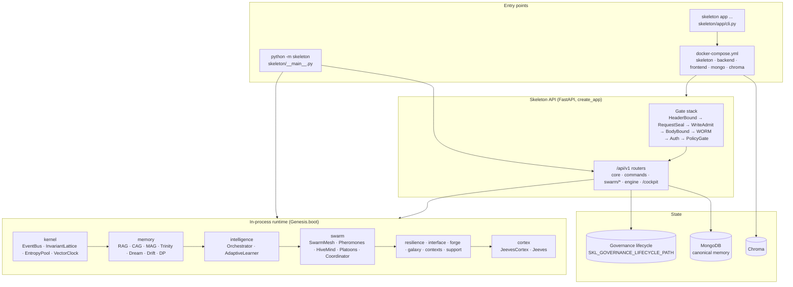

# Skeleton Architecture Reference (rollout set)

> Generated from main @ `40e81412e995a9b153a02ff39f3ae1aec187de25` on 2026-10-10.
> Owner: Technical Director. Scope: what exists on `main` at that SHA, nothing aspirational.
> Existing deeper references stay authoritative for their slice:
> [`REPOSITORY_ATLAS.md`](REPOSITORY_ATLAS.md), [`../ARCHITECTURE_MAP.md`](../ARCHITECTURE_MAP.md),
> [`../APP_ASSEMBLY.md`](../APP_ASSEMBLY.md), [`../MEMORY_RETRIEVAL.md`](../MEMORY_RETRIEVAL.md).

## Pages

| Page | Covers | Primary source on main |
|------|--------|------------------------|
| [kernel.md](kernel.md) | Kernel primitives and the Genesis boot sequence | `skeleton/kernel/`, `skeleton/bootstrap/genesis.py` |
| [agents-swarm.md](agents-swarm.md) | Agent coordination, swarm runtime, swarm control-plane routes | `skeleton/automation/agents/`, `skeleton/automation/swarm/`, `skeleton/api/swarm_*_routes.py` |
| [memory-retrieval.md](memory-retrieval.md) | Memory planes, governed memory writer, retrieval stack | `skeleton/memory/`, `skeleton/retrieval/` |
| [api-gateway.md](api-gateway.md) | FastAPI app factory, Gate middleware stack, auth, limits | `skeleton/api/server.py`, `skeleton/api/middleware.py` |
| [cli-app-entry.md](cli-app-entry.md) | `python -m skeleton`, `skeleton app`, Compose topology | `skeleton/__main__.py`, `skeleton/app/cli.py`, `docker-compose.yml` |
| [../api/README.md](../api/README.md) | Every HTTP route mounted by `create_app()` | `skeleton/api/*.py` |
| [../engineering/PERFORMANCE_BUDGETS.md](../engineering/PERFORMANCE_BUDGETS.md) | Time/size budgets, CI gate policy | `skeleton/api/*`, `.github/workflows/ci.yml` |

## System map

## Layer map

| Layer | Canonical package | Compatibility shim(s) | Booted by |
|-------|-------------------|-----------------------|-----------|
| Foundation | `skeleton.foundation` | — | `Genesis._phase_foundation` |
| Kernel | `skeleton.kernel` | — | `Genesis._phase_kernel` |
| Memory | `skeleton.memory` | — | `Genesis._phase_memory` |
| Retrieval / interface | `skeleton.retrieval`, `skeleton.observability` | — | `Genesis._phase_interface` |
| Intelligence | `skeleton.intelligence` | — | `Genesis._phase_intelligence` |
| Agents | `skeleton.automation.agents` | `skeleton.agents.*` (one-line re-exports) | `Genesis._phase_swarm` (Coordinator, MeshBridge) |
| Swarm | `skeleton.automation.swarm` | `skeleton.swarm.*` (one-line re-exports) | `Genesis._phase_swarm` |
| Resilience | `skeleton.resilience` | — | `Genesis._phase_resilience` |
| Forge | `skeleton.forge` | — | `Genesis._phase_forge` |
| Galaxy | `skeleton.galaxy` | — | `Genesis._phase_galaxy` |
| Contexts / support | `skeleton.contexts`, `skeleton.support`, `skeleton.overseer` | — | `Genesis._phase_contexts`, `_phase_support` |
| Cortex | `skeleton.cortex`, `skeleton.jeeves` | — | `Genesis._phase_cortex` |
| API | `skeleton.api` | — | `skeleton.api.server.create_app` |
| App assembly | `skeleton.app` | — | `python -m skeleton app` |

`skeleton.genesis` is itself a shim for `skeleton.bootstrap.genesis`.

## Known drift (main @ 40e8141)

Recorded so nobody builds on a stale map. Each item is a fact on main, not a proposal.

1. **Boot phase count.** Root `README.md` documents a "7-phase boot protocol". `skeleton/bootstrap/genesis.py` boots **12** phases: foundation, kernel, memory, intelligence, swarm, resilience, interface, forge, galaxy, contexts, support, cortex.
2. **Root README endpoint list is partial.** It lists 8 routes; `create_app()` mounts 200+ (see [../api/README.md](../api/README.md)).
3. **Unmounted routers.** `skeleton/api/omnifabric_routes.py` and `skeleton/api/cortex_routes.py` define routers that `create_app()` does not include. `skeleton/api/gameforge_routes.py` defines `/gameforge/intake` and `/gameforge/run`, but the mounted versions come from `skeleton/api/routes.py`; the sidecar module is not mounted. `python -m skeleton capabilities --cortex-audit` / `--sidecar-audit` report this.
4. **Two backends.** `backend/server.py` (≈207 KB, `APIRouter(prefix="/api")`, ~300 modules under `backend/routes/`) is a separate service from the Skeleton engine API. This set documents the engine API; the backend surface is not enumerated here.
5. **Shim namespaces.** `skeleton.agents.*` and `skeleton.swarm.*` are one-line re-exports; new code must import `skeleton.automation.agents` / `skeleton.automation.swarm`.
6. **`skeleton/architecture_round3.py` … `architecture_round22.py`** are ~165-byte stubs at package root. They add import surface without behaviour.
7. **Deprecated FastAPI hooks.** `create_app()` uses `@app.on_event("startup"/"shutdown")`, not a lifespan context.
