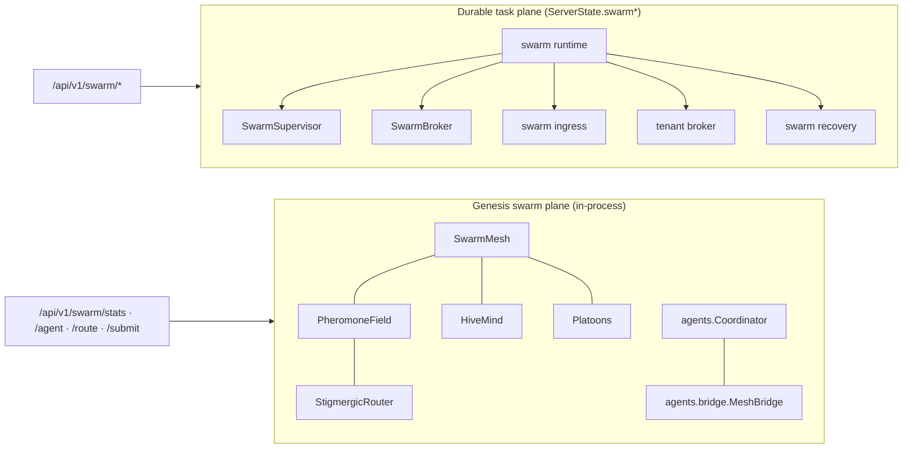

# Agents and swarm

> Generated from main @ `40e81412e995a9b153a02ff39f3ae1aec187de25` on 2026-10-10. Index: [README.md](README.md).

## Packages

| Canonical package | Shim | Contents on main |
|-------------------|------|------------------|
| `skeleton/automation/agents/` | `skeleton/agents/*.py` (each file is `from skeleton.automation.agents.X import *`) | Agent runtime, coordination, delegation, autonomy/human control, and the durable **swarm task runtime** (`swarm_runtime.py`, `swarm_broker.py`, `swarm_tenant_broker.py`, `swarm_supervisor.py`, `swarm_recovery.py`, `swarm_checkpoint.py`, `swarm_ingress.py`, `swarm_fencing.py`, `swarm_quota.py`, `swarm_rate_limit.py`, `swarm_fairness.py`, ...) |
| `skeleton/automation/swarm/` | `skeleton/swarm/*.py` | Mesh-level coordination: `mesh.py` (SwarmMesh, HiveMind), `stigmergy`, `platoons`, `negotiation`, `consensus.py`, `quorum.py`, `blackboard.py`, `boardroom.py`, `dag.py`, `handoff.py`, `legions.py`, `multi_agent_orchestration.py`, `ready_wave_runner.py` |

New code imports the canonical package; the shims exist for compatibility only.

## Two swarm planes

1. **Genesis mesh plane** — wired in `Genesis._phase_swarm`: `mesh`, `pheromones`, `stigmergy`, `hive`, `negotiator`, `platoons`, `coordinator`, `bridge`. Exposed by `skeleton/api/routes.py` as `GET /api/v1/swarm/stats`, `POST /api/v1/swarm/agent`, `POST /api/v1/swarm/route`, `POST /api/v1/swarm/submit` (the last requires `require_charter("swarm", "submit")`).
2. **Durable task plane** — held on `ServerState` (`swarm`, `swarm_recovery`, `swarm_supervisor`, `swarm_broker`, `swarm_ingress`, `swarm_tenant_broker`). `ServerState.bind_swarm_runtime()` replaces the runtime and rebinds dependent control planes under `_swarm_bind_lock`. Exposed by 12 routers (`skeleton/api/swarm_*_routes.py`).

## Durable task plane routers

| Router module | Prefix (under `/api/v1`) | Purpose |
|---------------|--------------------------|---------|
| `swarm_routes.py` | `/swarm` | Workers, tasks, leases, renew/success/failure, reap, dead-letter, state snapshot/restore, events |
| `swarm_operator_routes.py` | `/swarm/operator` | Overview, hot workers, autoscale, SLO, snapshots, prune, GC, checkpoint/restore, failover election, recovery |
| `swarm_policy_routes.py` | `/swarm/policy` | Admission preview, worker ranking per task |
| `swarm_lifecycle_routes.py` | `/swarm/lifecycle` | Pressure, worker drain, reap-stale |
| `swarm_integrity_routes.py` | `/swarm/integrity` | Audit, assert |
| `swarm_fence_routes.py` | `/swarm/fenced` | Fenced success/failure/renew |
| `swarm_supervisor_routes.py` | `/swarm/supervisor` | Status, dispatch preview, quarantine, worker success/failure |
| `swarm_broker_routes.py` | `/swarm/broker` | Status, submit, task success/failure |
| `swarm_batch_routes.py` | `/swarm/batch` | Batch submit |
| `swarm_ingress_routes.py` | `/swarm/ingress` | Tenant config, admit, lease, complete |
| `swarm_tenant_broker_routes.py` | `/swarm/tenant-broker` | Status, reconcile, repair, submit, task success/failure |
| `swarm_recovery_archive_routes.py` | `/swarm/recovery` | Archive, catalog, activate |

Full method/path list: [../api/README.md](../api/README.md#swarm-durable-task-plane).

## CI coverage

`ci.yml` job **Skeleton GameForge** runs the swarm suites from `skeleton/testing/test_swarm_*.py` plus `test_server_swarm_bundle.py` and `test_server_recovery_health.py`.

## Technical risk (agents/swarm)

- Two planes share the `/api/v1/swarm` prefix with different state owners (Genesis handles vs `ServerState.swarm*`). Route ownership must be checked before adding a path.
- ~70 shim files in `skeleton/agents/` and ~22 in `skeleton/swarm/` double the import surface.
