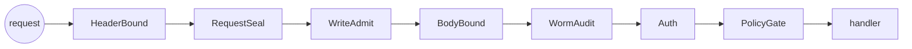

# API gateway and services

> Generated from main @ `40e81412e995a9b153a02ff39f3ae1aec187de25` on 2026-10-10. Index: [README.md](README.md). Route list: [../api/README.md](../api/README.md).

## App factory (`skeleton/api/server.py:create_app`)

- `FastAPI(title="Skeleton API", version="16.0.0")`
- `RuntimeServiceLifecycle("skeleton")` on `app.state.runtime_lifecycle`; `RuntimeAdmissionMiddleware` rejects traffic until ready, exempting `/api/v1/health`.
- Routers mounted at `/api/v1`: `routes.router`, `command_routes`, 12 `swarm_*_routes`, `engine_routes`. `cockpit.router` is mounted at root (`/cockpit`).
- Inline routes: `GET /` and `GET /cortex/status`.
- `install_gate(app, policy=GatePolicy(open_prefixes=..., body_limits=...))`.
- Startup: Genesis boot (if needed) → governance → artifact store → retrieval index → engine execution service → Mongo memory writer (if `SKL_MONGO_URI`) → `recover_engine_executions()` → `mark_ready`.
- Shutdown: `begin_drain` → close memory writer → close engine execution service → close governance → close operation runtime → `mark_stopped`.
- `run_server(host="0.0.0.0", port=8000)`; in Compose the `skeleton` container listens on 8001, published as `${SKELETON_PORT:-8010}`.

## Gate middleware stack (`skeleton/api/middleware.py:install_gate`)

Order, outer → inner (Starlette `add_middleware` is LIFO):

| Layer | Module | Effect |
|-------|--------|--------|
| HeaderBound | `api/request_bounds.py` | Default 32 768 header bytes / 100 headers; `SKELETON_GATE_MAX_HEADER_BYTES`, `SKELETON_GATE_MAX_HEADER_COUNT` |
| RequestSeal | `api/middleware.py`, `api/hmac_seal.py` | HMAC seal on non-open prefixes |
| WriteAdmit | `api/admit_write.py` | Admission for mutating methods |
| BodyBound | `api/middleware.py` | Default 1 MiB (`_DEFAULT_MAX_BODY`), `SKELETON_GATE_MAX_BODY_BYTES`, per-route overrides |
| WormAudit | `api/middleware.py` | Append-only audit |
| Auth | `api/middleware.py`, `api/auth.py` | Bearer/principal |
| PolicyGate | `api/middleware.py` | Longest-prefix route → governance domain (`DEFAULT_DOMAIN_MAP`) |

Per-route body ceilings (`_gate_body_limits`): `/api/v1/engine/media/images/edit` 70 MiB, `/api/v1/engine/media/images/variation` 34 MiB, `/api/v1/engine/executions` 4 MiB.

### Open (unsealed) prefixes

- Always: `DEFAULT_OPEN_PREFIXES` = `/health`, `/ready`, `/api/v1/health/live`, `/api/v1/health/ready`; plus `/` and `/api/v1/engine` (engine routes enforce their own service bearer token in `api/engine_routes.py`).
- Only when `SKELETON_PUBLIC_DEV_SURFACES` is truthy: `/cortex/status`, `/cockpit`, `/docs`, `/openapi.json`, `/redoc`, `/api/v1/health`, `/api/v1/metrics`, `/api/v1/genesis`.

### Handler-level guards

- `require_charter(domain, action)` on `POST /swarm/submit`, `/forge/blueprint`, `/forge/materialise`, `/forge/archetype` (`api/charter_gate.py`).
- `IdempotencyGuard` (`api/idempotency.py`) in `routes.py`.

## `APIGateway` class (`skeleton/api/gateway.py`)

A separate in-process router (`route()`, `handle()`, `card()`) with RBAC scope check → per-actor sliding-window rate limit → optional response cache (SHA-256 of canonical JSON payload) → transforms → per-route stats (`calls`, `errors`, `mean_ms`). It is **not** the FastAPI request path; it records the only per-route latency stats on main.

## Services behind the gateway (`ServerState`)

`ServerState` holds handles for: `genesis`, `jeeves`, `forge`, `mesh`, `registry`, `ledger`, `scheduler`, swarm runtime + control planes, `cockpit`, NPC/game-logic/animation pipelines, `gameforge`, `memory_trinity`, `resilience`, `intelligence`, engine execution service/coordinator/admission/quota/pressure ledgers, governance registry/lifecycle/audit, canonical artifact/retrieval/memory authorities, and Jeeves SAM/CLOM/KREM/memory.

## Compose topology (`docker-compose.yml`)

| Service | Published port | Notes |
|---------|----------------|-------|
| `skeleton` | `${SKELETON_PORT:-8010}` → 8001 | read-only FS, `cap_drop: ALL`; requires `SKL_MONGO_URI` |
| `backend` | `${BACKEND_PORT:-8001}` → 8001 | separate FastAPI app (`backend/server.py`, prefix `/api`) |
| `frontend` | `${FRONTEND_PORT:-3000}` | |
| `mongo` | `127.0.0.1:${MONGO_PORT:-27017}` | |
| `chroma` | `127.0.0.1:${CHROMA_PORT:-8000}` | |
