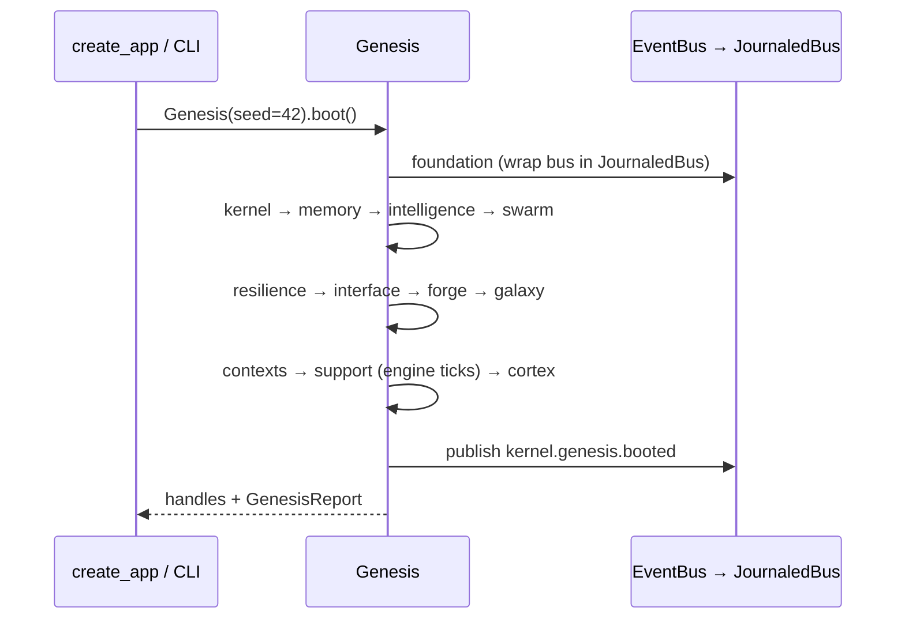

# Kernel and Genesis boot

> Generated from main @ `40e81412e995a9b153a02ff39f3ae1aec187de25` on 2026-10-10. Index: [README.md](README.md).

## Kernel package (`skeleton/kernel/`)

The public kernel surface is what `skeleton/kernel/__init__.py` exports:

| Export | Defined in | Role |
|--------|-----------|------|
| `SkeletonError`, `BlueprintError`, `MaterialisationError` | `kernel/primitives.py` | Root error types (API maps them in `skeleton/api/errors.py`) |
| `DomainEvent`, `EventBus` | `kernel/primitives.py` (re-exported by `kernel/events.py`) | In-process pub/sub; every Genesis phase publishes on one bus |
| `AssuranceEnvelope`, `AssuranceState` | `kernel/assurance.py` | Assurance state carried with work items |
| `CausalGraph`, `CausalNode`, `CausalPath`, `CausalGraphError` | `kernel/causality.py` | Causal dependency tracking |
| `UserId`, `BlueprintId` | `kernel/primitives.py` | Typed identifiers |
| `EntropyPool` | `kernel/primitives.py` | Seeded randomness (`Genesis(seed=42)` in API/CLI boot) |
| `VectorClock` | `kernel/primitives.py` | Logical time |
| `Invariant`, `InvariantLattice` | `kernel/primitives.py` | Runtime invariants evaluated by `Genesis.health()` |
| `CapabilityRegistry` | `kernel/primitives.py` | Capability lookup |
| `SubmitterCapError` | `kernel/work_queue.py` | Per-submitter queue cap violation |

Other kernel modules used by the running API (not re-exported from `__init__`):

| Module | Used for |
|--------|----------|
| `kernel/runtime_supervision.py` | `RuntimeServiceLifecycle` + `RuntimeAdmissionMiddleware`: readiness/drain state for the API process (`create_app()` marks ready only after engine recovery) |
| `kernel/backpressure.py`, `kernel/bulkhead.py`, `kernel/breaker.py`, `kernel/budget.py` | Load-shedding, isolation, circuit breaking, budget accounting primitives |
| `kernel/work_queue.py`, `kernel/scheduler.py`, `kernel/global_resource_scheduler.py` | Work admission and scheduling |
| `kernel/distributed_ordering.py`, `kernel/crdt.py`, `kernel/gossip.py`, `kernel/election.py` | Distributed ordering / replication primitives |
| `kernel/slo.py` | `SLO` miss-cap counter (default `miss_cap=3`) |
| `kernel/omnifabric/` | Omnifabric doctrine (its router is **not mounted**, see README drift) |

`kernel/` also contains in-package tests (`test_capsec.py`, `test_capsec_phase2.py`, `test_assurance_*.py`).

## Genesis (`skeleton/bootstrap/genesis.py`)

`Genesis(seed=...).boot()` builds the whole in-process runtime on one `EventBus` and returns handles. It is called by:

- `create_app()` startup when `state.genesis is None` (`skeleton/api/server.py`)
- the CLI for `run`, `tool`, `memory`, `admin`, `retrieve`, `plan`, `evidence` shared commands (`_boot_runtime_if_needed` in `skeleton/__main__.py`)

| # | Phase | Handles wired (`report.wired[phase]`) |
|---|-------|---------------------------------------|
| 1 | foundation | `dag`, `journal`, `replay`, `ocap`, `membrane`, `temporal` — bus becomes a `JournaledBus` so every later event is hash-chained |
| 2 | kernel | `lattice` (InvariantLattice), `entropy` (EntropyPool), `clock` (VectorClock) |
| 3 | memory | `rag`, `cag`, `mag`, `trinity`, `repetition`, `dream`, `drift`, `dp` |
| 4 | intelligence | `orchestrator` (IntelligenceOrchestrator), `adaptive` (AdaptiveLearner) |
| 5 | swarm | `mesh`, `pheromones`, `stigmergy`, `hive`, `negotiator`, `platoons`, `coordinator`, `bridge` |
| 6 | resilience | `fortress`, `canaries`, `chaos` |
| 7 | interface | `anomaly`, `provenance`, `reranker`, `ranker`, `quad` |
| 8 | forge | `forge` (`skeleton.forge.universal.Forge`) |
| 9 | galaxy | `galaxy`, `galaxy_transport`, `consensus`, `election`, `fleet`, `byzantine`, optionally `kag_sync`, `galaxy_bridge` |
| 10 | contexts | `fabric`, `workorders`, `backlog`, `planning`, `queue`, `oracle`, `syntax_fixer`, `cycle`, `causal` |
| 11 | support | `support`, `loader`, optional `agentic_rag`, `overseer`, `engine`, `engine_v2`, `engine_v3`, `engine_v35` (each engine is ticked once during boot) |
| 12 | cortex | `cortex` (`live_cortex` if persistence configured, else fresh `JeevesCortex`), `jeeves` |

`Genesis.health()` returns phases, subsystem count, bus stats, invariant violations, temporal health and journal integrity; `healthy` is false on any invariant violation or temporal failure.

## Technical risk (kernel)

- Boot is synchronous and runs inside FastAPI's async `startup` hook; phase 11 ticks four engines inline. There is no measured boot budget (see [../engineering/PERFORMANCE_BUDGETS.md](../engineering/PERFORMANCE_BUDGETS.md) §Boot).
- The root README still describes 7 phases.
