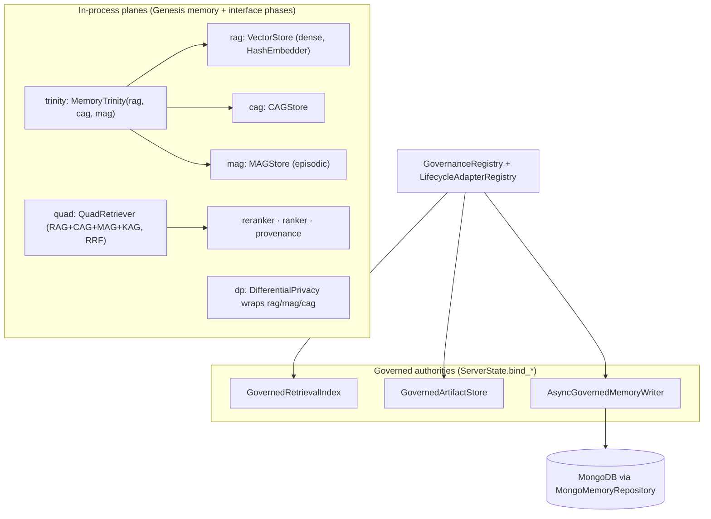

# Memory and retrieval

> Generated from main @ `40e81412e995a9b153a02ff39f3ae1aec187de25` on 2026-10-10. Index: [README.md](README.md).
> Deeper design notes: [`../MEMORY_RETRIEVAL.md`](../MEMORY_RETRIEVAL.md), [`../ADAPTIVE_MEMORY_CONTEXT_PLANE.md`](../ADAPTIVE_MEMORY_CONTEXT_PLANE.md).

## Three layers

### 1. In-process planes (`skeleton/memory/`)

Wired by `Genesis._phase_memory` (`skeleton/bootstrap/genesis.py`):

| Handle | Class | Module |
|--------|-------|--------|
| `rag` | `VectorStore` | `memory/vector.py` |
| `cag` | `CAGStore` | `memory/core.py` |
| `mag` | `MAGStore(UserId.new())` | `memory/core.py` |
| `trinity` | `MemoryTrinity(rag, cag, mag)` | `memory/core.py` |
| `repetition` | `RepetitionScheduler` | `memory/core.py` |
| `dream` | `DreamEngine(mag, rag)` | `intelligence/dream.py` |
| `drift` | `PersonaDriftDetector` | `memory/drift.py` |
| `dp` | `DifferentialPrivacy(session_budget=1.0, per_plane_budget=0.5)` | `memory/dp.py` |

Invariant registered: `mag_index_consistent` (every MAG tag-index entry refers to a stored episode).

Other modules on main: `delta_memory.py` (`DeltaMemory`, `DeltaMemoryPort`), `consolidation.py` (`ConsolidationCycle`), `compaction.py` / `guarded_compaction.py` / `rot_guard.py`, `projection.py`, `reconciliation.py`, `writeback.py`, `forgetting.py`, `eviction.py`, and optional vector accelerators `jvm_vector_accelerator.py` / `asm_vector_accelerator.py` (see [`../java-accelerators.md`](../java-accelerators.md)).

### 2. Retrieval stack (`skeleton/retrieval/`)

Wired by `Genesis._phase_interface`: `anomaly`, `provenance` (`ProvenanceLedger`), `reranker` (`FeatureReranker`), `ranker` (`Ranker`), `quad` (`QuadRetriever`, with `KAGRetriever`).

Package exports (`retrieval/__init__.py`): `Fuser`, `FusionStrategy`, `ScoredResult`, `Ranker`, `FeatureReranker`, `ProvenanceLedger`, `ProvenanceEntry`, `QuadRetriever`, `PlaneResult`, `KnowledgeGraph`, `KAGRetriever`, `Triple`, `TripleExtractor`.

### 3. Governed authorities (bound on API startup)

`create_app()` startup in `skeleton/api/server.py` calls, in order:

1. `bind_governance_registry()` — `DataLifecycleRegistry` at `SKL_GOVERNANCE_LIFECYCLE_PATH` (default `:memory:`), `AuditLog` (`SKL_GOVERNANCE_AUDIT_PATH` or `<lifecycle>.audit.jsonl`), `GovernanceRegistry`, `LifecycleExecutor`.
2. `bind_canonical_artifact_store()` — `GovernedArtifactStore` at `SKL_GOVERNANCE_ARTIFACT_ROOT` (default derived from lifecycle path, or `./.skeleton-governed-artifacts`).
3. `bind_canonical_retrieval_index()` — tenant-scoped `GovernedRetrievalIndex` (`retrieval/governance.py`).
4. `bind_engine_execution_service()`.
5. `bind_canonical_memory_writer()` **only if `SKL_MONGO_URI` is set** — `MongoMemoryRepository` (`persistence/memory_repository.py`) + `AsyncGovernedMemoryWriter` (`memory/writeback.py`) + `AsyncMemoryProjectionCoordinator` (`memory/projection.py`).

Each authority registers deletion/export adapters (`artifact`, `retrieval`, `memory`) so governance erasure reaches every store.

`bind_verified_memory_finalization()` persists memory only when an execution's `context_policy.memory_write_intent.content_from == "verified_final_output"`, with tenant, subject, kind, provenance refs (`execution:`, `context:`, `provider:`, `tool:`), and an idempotency key.

## HTTP surface

| Method | Path | Backing handle |
|--------|------|----------------|
| POST | `/api/v1/retrieval/query` | `quad.retrieve(query, k, use_cache)` |
| POST | `/api/v1/retrieval/ingest` | `quad.ingest_document(doc_id, text, metadata, salience)` |
| POST | `/api/v1/retrieval/feedback` | `record_plane_feedback(quad, used_planes, all_planes)` |
| POST | `/api/v1/memory/query` | `state.memory_trinity.query_unified(query, top_k_per_tier, metadata_filter)`; optional `turns` → `compact_turns` |
| GET | `/api/v1/interface/reranker/stats` | reranker stats |

## Technical risk (memory/retrieval)

- `retrieval/query` validates `k` with `minimum=1` and `memory/query` validates `top_k` with `minimum=1`; neither has an upper bound in `skeleton/api/routes.py`. Unbounded fan-out is a latency risk (see budgets).
- Without `SKL_MONGO_URI`, the canonical memory writer is not bound and memory is process-local.
